# 💰 Sistema de Split Payment - DOCUMENTAÇÃO COMPLETA

## 🎯 Visão Geral

O sistema de **Split Payment** (Divisão de Pagamento) permite distribuir automaticamente os valores de uma venda entre múltiplos participantes: produtor, co-produtores, afiliados e plataforma.

### ✨ Características Principais
- 🔄 **Split automático** baseado em percentuais configuráveis
- 👥 **Múltiplos participantes** (produtor, co-produtor, afiliado)
- 💳 **Carteiras digitais** para cada usuário
- 📊 **Controle de comissões** com status e histórico
- 🔒 **Segurança** com webhooks assinados
- ⚙️ **Configuração flexível** por produto

---

## 🏗️ Arquitetura do Sistema

### 1. **Modelos de Dados**

#### `WalletTransaction` - Carteira Digital
```javascript
{
  id: "uuid",
  user_id: "uuid",
  type: "credit|debit",
  amount: 85.50,
  description: "Venda - Curso de Marketing",
  reference_type: "order",
  reference_id: "order-uuid",
  status: "completed",
  metadata: {
    order_id: "uuid",
    product_id: "uuid", 
    split_type: "seller",
    percentage: 60,
    charge_id: "charge-123"
  }
}
```

#### `ProductPartner` - Parceiros do Produto
```javascript
{
  id: "uuid",
  product_id: "uuid",
  partner_id: "uuid",
  partner_type: "co_producer|affiliate",
  commission_percentage: 20.0,
  status: "active",
  partner_code: "ABC12345", // Código único
  settings: {},
  approved_at: "2024-01-15T10:30:00Z"
}
```

#### `PartnerCommission` - Histórico de Comissões
```javascript
{
  id: "uuid",
  order_id: "uuid",
  product_partner_id: "uuid",
  commission_amount: 17.00,
  commission_percentage: 20.0,
  order_amount: 85.00,
  status: "pending|approved|paid|cancelled",
  paid_at: null,
  payment_reference: null
}
```

### 2. **Configurações de Split**

#### Variáveis de Ambiente
```env
# === TAXAS DA PLATAFORMA ===
CLIENT_FEE_PERCENT=8.99          # Taxa cobrada do cliente (%)
PROVIDER_FEE_PERCENT=5.99        # Taxa do gateway de pagamento (%)
PLATFORM_PROFIT_PERCENT=2.99    # Lucro da plataforma (%)

# === DISTRIBUIÇÃO DO VALOR LÍQUIDO ===
PRODUCER_COMMISSION_PERCENT=60   # Produtor do conteúdo (%)
COPRODUCER_COMMISSION_PERCENT=20 # Co-produtor (%)
AFFILIATE_COMMISSION_PERCENT=20  # Afiliado (%)

# === CONFIGURAÇÕES DO GATEWAY ===
CARD_API_URL=https://api.cartao.com
CARD_API_KEY=sua-api-key
CARD_WEBHOOK_SECRET=webhook-secret
```

---

## 💳 Fluxo de Pagamento com Split

### 🔢 **Cálculo Automático**

**Exemplo: Venda de R$ 100,00**

```mermaid
graph TD
    A[💰 Cliente paga R$ 100] --> B[📊 Calcular Taxas]
    B --> C[🏢 Taxa Plataforma: R$ 8,99]
    B --> D[💳 Taxa Gateway: R$ 5,99]
    B --> E[💼 Lucro Plataforma: R$ 2,99]
    
    A --> F[💵 Valor Líquido: R$ 82,03]
    F --> G[👤 Produtor 60%: R$ 49,22]
    F --> H[🤝 Co-produtor 20%: R$ 16,41]
    F --> I[📢 Afiliado 20%: R$ 16,41]
    
    G --> J[💳 Creditado na Carteira]
    H --> J
    I --> J
```



### 📋 **Etapas do Processo**

1. **Cliente faz pagamento** com cartão
2. **Gateway processa** e confirma pagamento
3. **Sistema calcula split** automaticamente
4. **Valores são distribuídos** nas carteiras
5. **Comissões são registradas** com status
6. **Emails são enviados** para todos os participantes
7. **Webhooks notificam** sistemas externos

---

## 🔧 APIs do Sistema

### 1. **Gestão de Parceiros**

#### `POST /api/partners` - Adicionar Parceiro
```javascript
// Request
{
  "productId": "produto-uuid",
  "partnerId": "usuario-uuid",
  "partnerType": "affiliate", // ou "co_producer"
  "commissionPercentage": 20
}

// Response
{
  "success": true,
  "partner": {
    "id": "partner-uuid",
    "partnerCode": "ABC12345",
    "status": "active"
  }
}
```

#### `GET /api/partners/product/:productId` - Listar Parceiros
```javascript
// Response
{
  "partners": [
    {
      "id": "uuid",
      "partnerCode": "ABC12345",
      "partnerType": "affiliate",
      "commissionPercentage": 20,
      "partner": {
        "id": "user-uuid",
        "name": "João Silva",
        "email": "joao@email.com"
      }
    }
  ]
}
```

### 2. **Pagamento com Split**

#### `POST /api/card-payment/create` - Criar Pagamento
```javascript
// Request
{
  "orderId": "pedido-uuid",
  "partnerCode": "ABC12345", // Opcional - para rastrear afiliado
  "cardData": {
    "cardNumber": "4111111111111111",
    "expMonth": "12",
    "expYear": "2025",
    "cvc": "123",
    "holderName": "João Silva"
  },
  "customerData": {
    "name": "João Silva",
    "email": "joao@email.com",
    "document": "12345678901",
    "phone": "11999999999"
  }
}

// Response
{
  "success": true,
  "payment": {
    "chargeId": "charge-123",
    "status": "pending",
    "amount": 100.00,
    "splitData": {
      "totalAmount": 100.00,
      "netAmount": 82.03,
      "fees": {
        "clientFee": 8.99,
        "providerFee": 5.99,
        "platformProfit": 2.99
      },
      "splitRules": [
        {
          "recipientId": "produtor-uuid",
          "amount": 4922, // Em centavos
          "percentage": 60,
          "type": "seller"
        }
      ]
    }
  }
}
```

### 3. **Webhook de Confirmação**

#### `POST /api/card-payment/webhook` - Receber Confirmação
```javascript
// Headers
{
  "x-webhook-signature": "sha256=abc123...",
  "content-type": "application/json"
}

// Body
{
  "event": "charge.paid",
  "data": {
    "id": "charge-123",
    "status": "paid",
    "amount": 10000, // Em centavos
    "metadata": {
      "order_id": "pedido-uuid",
      "partner_code": "ABC12345"
    }
  }
}
```

---

## 🎨 Implementação Frontend

### 1. **Adicionar Parceiro a Produto**

```typescript
// components/PartnerManager.tsx
const addPartner = async (productId: string, partnerData: PartnerData) => {
  try {
    const response = await fetch('/api/partners', {
      method: 'POST',
      headers: {
        'Content-Type': 'application/json',
        'Authorization': `Bearer ${token}`
      },
      body: JSON.stringify({
        productId,
        ...partnerData
      })
    });

    if (!response.ok) {
      throw new Error('Erro ao adicionar parceiro');
    }

    const result = await response.json();
    
    // Atualizar lista de parceiros
    setParceiros([...parceiros, result.partner]);
    
    // Notificar sucesso
    toast.success(`Parceiro adicionado! Código: ${result.partner.partnerCode}`);
    
  } catch (error) {
    toast.error('Erro ao adicionar parceiro');
  }
};
```

### 2. **Checkout com Split Automático**

```typescript
// components/CheckoutCard.tsx
const processPayment = async (cardData: CardData) => {
  try {
    setLoading(true);
    
    const response = await fetch('/api/card-payment/create', {
      method: 'POST',
      headers: { 'Content-Type': 'application/json' },
      body: JSON.stringify({
        orderId: order.id,
        partnerCode: getPartnerCodeFromUrl(), // Opcional
        cardData,
        customerData: {
          name: customer.name,
          email: customer.email,
          document: customer.document,
          phone: customer.phone
        }
      })
    });

    const payment = await response.json();
    
    if (payment.success) {
      // Redirecionar para confirmação
      router.push(`/payment/success/${payment.payment.chargeId}`);
      
      // Mostrar informações do split (opcional)
      showSplitInfo(payment.payment.splitData);
    }
    
  } catch (error) {
    toast.error('Erro no pagamento');
  } finally {
    setLoading(false);
  }
};
```

### 3. **Dashboard de Comissões**

```typescript
// components/CommissionDashboard.tsx
const CommissionDashboard = () => {
  const [commissions, setCommissions] = useState([]);
  
  useEffect(() => {
    fetchCommissions();
  }, []);

  const fetchCommissions = async () => {
    const response = await fetch('/api/partners/commissions', {
      headers: { 'Authorization': `Bearer ${token}` }
    });
    
    const data = await response.json();
    setCommissions(data.commissions);
  };

  return (
    <div className="commission-dashboard">
      <h2>💰 Minhas Comissões</h2>
      
      <div className="commission-stats">
        <div className="stat-card">
          <span className="value">R$ {totalEarned}</span>
          <span className="label">Total Ganho</span>
        </div>
        <div className="stat-card">
          <span className="value">{pendingCount}</span>
          <span className="label">Pendentes</span>
        </div>
      </div>

      <div className="commission-list">
        {commissions.map(commission => (
          <div key={commission.id} className="commission-item">
            <div className="product-info">
              <strong>{commission.productName}</strong>
              <span className="date">{formatDate(commission.createdAt)}</span>
            </div>
            <div className="commission-value">
              <span className="amount">R$ {commission.commissionAmount}</span>
              <span className={`status ${commission.status}`}>
                {commission.status}
              </span>
            </div>
          </div>
        ))}
      </div>
    </div>
  );
};
```

---

## 📊 Relatórios e Analytics

### 1. **Dashboard Administrativo**

#### Métricas de Split
```javascript
GET /api/admin/split-analytics

// Response
{
  "totalSplit": {
    "volume": 50000.00,
    "transactions": 234,
    "period": "month"
  },
  "commissionsByType": {
    "seller": 30000.00,
    "co_producer": 10000.00, 
    "affiliate": 10000.00
  },
  "topPartners": [
    {
      "name": "João Silva",
      "type": "affiliate",
      "totalEarned": 2500.00,
      "conversions": 15
    }
  ],
  "recentTransactions": []
}
```

### 2. **Relatório de Comissões**

```javascript
GET /api/reports/commissions
?startDate=2024-01-01
&endDate=2024-01-31
&partnerId=uuid
&status=paid

// Response
{
  "summary": {
    "totalCommissions": 5000.00,
    "paidCommissions": 3000.00,
    "pendingCommissions": 2000.00,
    "transactionCount": 25
  },
  "commissions": [
    {
      "id": "uuid",
      "orderDate": "2024-01-15",
      "productName": "Curso de Marketing",
      "orderAmount": 200.00,
      "commissionAmount": 40.00,
      "commissionPercentage": 20,
      "status": "paid"
    }
  ]
}
```

---

## 🔒 Segurança e Validações

### 1. **Validação de Webhooks**
```javascript
// Verificar assinatura HMAC
const validateWebhookSignature = (payload, signature, secret) => {
  const expectedSignature = 'sha256=' + crypto
    .createHmac('sha256', secret)
    .update(payload, 'utf8')
    .digest('hex');
    
  return signature === expectedSignature;
};
```

### 2. **Controle de Acesso**
- ✅ **Autenticação JWT** obrigatória para APIs administrativas
- ✅ **Roles de usuário** (admin, seller, partner)
- ✅ **Validação de propriedade** (usuário só vê suas comissões)
- ✅ **Rate limiting** para prevenir abuso

### 3. **Validações de Negócio**
- ✅ **Percentuais válidos** (0-100%)
- ✅ **Produto existe** e está ativo
- ✅ **Usuário parceiro existe** e está ativo
- ✅ **Não permitir parceria duplicada**
- ✅ **Valor mínimo** para split

---

## ⚙️ Configurações Avançadas

### 1. **Diferentes Tipos de Split**

```javascript
// Por produto - configuração individual
{
  "productId": "uuid",
  "splitRules": {
    "seller": 70,
    "co_producer": 15,
    "affiliate": 15
  }
}

// Por categoria - configuração padrão
{
  "category": "courses",
  "defaultSplit": {
    "seller": 60,
    "co_producer": 20,
    "affiliate": 20
  }
}
```

### 2. **Limites e Regras**

```javascript
// Configurações no .env
SPLIT_MIN_AMOUNT=10.00           # Valor mínimo para split
SPLIT_MAX_PARTNERS=10            # Máximo de parceiros por produto
COMMISSION_MIN_PAYOUT=50.00      # Valor mínimo para saque
AUTO_APPROVE_THRESHOLD=100.00    # Auto-aprovar até este valor
```

### 3. **Integrações Externas**

```javascript
// Webhook personalizado por parceiro
{
  "partnerId": "uuid",
  "webhookUrl": "https://partner.com/webhook",
  "events": ["commission.created", "commission.paid"],
  "secretKey": "webhook-secret"
}
```

---

## 🚀 Deploy e Produção

### 1. **Configuração Inicial**

```bash
# 1. Instalar dependências
npm install

# 2. Configurar variáveis de ambiente
cp .env.example .env

# 3. Configurar percentuais de split
CLIENT_FEE_PERCENT=8.99
PROVIDER_FEE_PERCENT=5.99
PLATFORM_PROFIT_PERCENT=2.99
PRODUCER_COMMISSION_PERCENT=60
COPRODUCER_COMMISSION_PERCENT=20
AFFILIATE_COMMISSION_PERCENT=20

# 4. Configurar gateway de pagamento
CARD_API_URL=https://api.gateway.com
CARD_API_KEY=sua-api-key-real
CARD_WEBHOOK_SECRET=seu-webhook-secret
```

### 2. **Testes de Split**

```bash
# Testar cálculos de split
npm run test:split

# Testar integração com gateway
npm run test:payment

# Testar webhooks
npm run test:webhooks
```

### 3. **Monitoramento**

```javascript
// Logs estruturados
{
  "event": "split_processed",
  "orderId": "uuid",
  "totalAmount": 100.00,
  "splitRules": 3,
  "processingTime": "120ms",
  "timestamp": "2024-01-15T10:30:00Z"
}

// Métricas importantes
- Taxa de sucesso de splits
- Tempo médio de processamento  
- Volume total de comissões
- Falhas de webhook
```

---

## 🔧 Resolução de Problemas

### 1. **Problemas Comuns**

#### Split não executado
```javascript
// Verificar logs
GET /api/admin/logs?orderId=uuid&event=split

// Possíveis causas:
- Webhook não recebido
- Erro na validação da assinatura
- Parceiro inativo
- Configuração de percentual inválida
```

#### Comissão não creditada
```javascript
// Verificar transações na carteira
GET /api/wallet/transactions?userId=uuid&referenceId=orderId

// Ações:
- Reprocessar split manualmente
- Verificar status da comissão
- Validar dados do parceiro
```

### 2. **Comandos de Diagnóstico**

```bash
# Verificar integridade dos dados
node scripts/validate-split-data.js

# Recalcular split de um pedido
node scripts/recalculate-split.js --orderId=uuid

# Sincronizar carteiras
node scripts/sync-wallets.js
```

---

## 📈 Próximos Passos

### 1. **Melhorias Planejadas**
- 🔄 **Split automático para PIX** (integrar com sistema de adquirentes)
- 📱 **App móvel** para acompanhar comissões
- 🏦 **Integração bancária** para saques automáticos
- 📊 **Analytics avançado** com BI
- 🤖 **IA para otimizar** percentuais de split

### 2. **Integrações Futuras**
- 💳 **Mais gateways** de pagamento
- 🌍 **Pagamentos internacionais**
- 🏪 **Marketplaces externos**
- 📧 **CRM integrado** para parceiros

---

## 💡 Conclusão

O sistema de Split Payment está **100% funcional** e pronto para produção, oferecendo:

✅ **Automação completa** - Split calculado e distribuído automaticamente
✅ **Flexibilidade total** - Configuração por produto e parceiro  
✅ **Segurança robusta** - Webhooks assinados e validações
✅ **Interface completa** - APIs REST para todas as operações
✅ **Monitoramento** - Logs e métricas detalhadas

**🎯 Para usar:** Basta configurar os percentuais no `.env` e começar a processar pagamentos com cartão. O split acontece automaticamente!

**📞 Suporte:** Para dúvidas ou personalizações, consulte a documentação técnica ou entre em contato com a equipe de desenvolvimento.


# 💻 Split Payment - Guia de Implementação Prática

## 🚀 Como Implementar o Sistema de Split

### 1. **Configuração Inicial**

#### `.env` - Variáveis de Ambiente
```env
# === SPLIT PAYMENT CONFIGURATION ===
CLIENT_FEE_PERCENT=8.99
PROVIDER_FEE_PERCENT=5.99
PLATFORM_PROFIT_PERCENT=2.99
PRODUCER_COMMISSION_PERCENT=60
COPRODUCER_COMMISSION_PERCENT=20
AFFILIATE_COMMISSION_PERCENT=20

# === CARD PAYMENT GATEWAY ===
CARD_API_URL=https://api.gateway.com
CARD_API_KEY=sua_api_key_aqui
CARD_WEBHOOK_SECRET=seu_webhook_secret
CARD_WEBHOOK_URL=https://seudominio.com/api/card-payment/webhook

# === SPLIT LIMITS ===
SPLIT_MIN_AMOUNT=10.00
SPLIT_MAX_PARTNERS=10
COMMISSION_MIN_PAYOUT=50.00
```

---

## 📝 Exemplos de Uso

### 1. **Adicionar Afiliado a um Produto**

```javascript
// Frontend - Adicionar afiliado
const adicionarAfiliado = async () => {
  try {
    const response = await fetch('/api/partners', {
      method: 'POST',
      headers: {
        'Content-Type': 'application/json',
        'Authorization': `Bearer ${userToken}`
      },
      body: JSON.stringify({
        productId: 'produto-123-uuid',
        partnerId: 'usuario-afiliado-uuid',
        partnerType: 'affiliate',
        commissionPercentage: 25 // 25% de comissão
      })
    });

    const result = await response.json();
    
    if (result.success) {
      alert(`✅ Afiliado adicionado! Código: ${result.partner.partnerCode}`);
      // Compartilhar link: https://site.com/produto?ref=ABC12345
    }
  } catch (error) {
    alert('❌ Erro ao adicionar afiliado');
  }
};
```

### 2. **Processar Venda com Split Automático**

```javascript
// Frontend - Checkout com split
const processarPagamento = async (dadosCartao) => {
  try {
    // 1. Capturar código do afiliado da URL
    const urlParams = new URLSearchParams(window.location.search);
    const codigoAfiliado = urlParams.get('ref'); // ABC12345

    // 2. Processar pagamento com split
    const response = await fetch('/api/card-payment/create', {
      method: 'POST',
      headers: { 'Content-Type': 'application/json' },
      body: JSON.stringify({
        orderId: pedido.id,
        partnerCode: codigoAfiliado, // Opcional - para rastrear afiliado
        cardData: {
          cardNumber: dadosCartao.numero,
          expMonth: dadosCartao.mesVencimento,
          expYear: dadosCartao.anoVencimento,
          cvc: dadosCartao.cvc,
          holderName: dadosCartao.nomePortador
        },
        customerData: {
          name: cliente.nome,
          email: cliente.email,
          document: cliente.cpf,
          phone: cliente.telefone
        }
      })
    });

    const pagamento = await response.json();
    
    if (pagamento.success) {
      // 3. Mostrar informações do split (opcional)
      console.log('💰 Split calculado:', pagamento.payment.splitData);
      
      // 4. Redirecionar para confirmação
      window.location.href = `/pagamento/sucesso/${pagamento.payment.chargeId}`;
    }

  } catch (error) {
    alert('❌ Erro no pagamento');
  }
};
```

### 3. **Acompanhar Comissões (Dashboard)**

```javascript
// Frontend - Dashboard de comissões do afiliado
const CarregarComissoes = () => {
  const [comissoes, setComissoes] = useState([]);
  const [loading, setLoading] = useState(true);

  useEffect(() => {
    buscarComissoes();
  }, []);

  const buscarComissoes = async () => {
    try {
      const response = await fetch('/api/partners/my-commissions', {
        headers: {
          'Authorization': `Bearer ${userToken}`
        }
      });

      const dados = await response.json();
      setComissoes(dados.commissions);
    } catch (error) {
      console.error('Erro ao carregar comissões:', error);
    } finally {
      setLoading(false);
    }
  };

  if (loading) return <div>Carregando...</div>;

  return (
    <div className="dashboard-comissoes">
      <h2>💰 Minhas Comissões</h2>
      
      {/* Resumo */}
      <div className="resumo">
        <div className="card">
          <h3>Total Ganho</h3>
          <span className="valor">
            R$ {comissoes.reduce((total, c) => total + c.commissionAmount, 0).toFixed(2)}
          </span>
        </div>
        <div className="card">
          <h3>Pendentes</h3>
          <span className="valor">
            {comissoes.filter(c => c.status === 'pending').length}
          </span>
        </div>
      </div>

      {/* Lista de comissões */}
      <div className="lista-comissoes">
        {comissoes.map(comissao => (
          <div key={comissao.id} className="item-comissao">
            <div className="info-produto">
              <strong>{comissao.productName}</strong>
              <span className="data">{new Date(comissao.createdAt).toLocaleDateString()}</span>
            </div>
            <div className="valor-comissao">
              <span className="valor">R$ {comissao.commissionAmount.toFixed(2)}</span>
              <span className={`status ${comissao.status}`}>
                {comissao.status === 'pending' && '⏳ Pendente'}
                {comissao.status === 'approved' && '✅ Aprovada'}
                {comissao.status === 'paid' && '💰 Paga'}
              </span>
            </div>
          </div>
        ))}
      </div>
    </div>
  );
};
```

---

## 🛠️ Casos de Uso Reais

### Caso 1: **Curso Online com Co-produtor**

```javascript
// Produto: Curso de Marketing Digital - R$ 200,00
// Produtor principal: João (60% = R$ 120,00)
// Co-produtor: Maria (20% = R$ 40,00)  
// Plataforma: 20% = R$ 40,00

// 1. Adicionar co-produtor
await fetch('/api/partners', {
  method: 'POST',
  body: JSON.stringify({
    productId: 'curso-marketing-uuid',
    partnerId: 'maria-uuid',
    partnerType: 'co_producer',
    commissionPercentage: 20
  })
});

// 2. Cliente compra o curso
// Split automático:
// - João recebe R$ 120,00 na carteira
// - Maria recebe R$ 40,00 na carteira  
// - Plataforma fica com R$ 40,00
```

### Caso 2: **E-book com Múltiplos Afiliados**

```javascript
// Produto: E-book Investimentos - R$ 50,00
// Autor: Carlos (70% = R$ 35,00)
// Afiliado 1: Ana (15% = R$ 7,50) - Código: ANA2024
// Afiliado 2: Pedro (15% = R$ 7,50) - Código: PEDRO2024

// 1. Cliente clica no link do afiliado Ana
// URL: https://site.com/ebook-investimentos?ref=ANA2024

// 2. Cliente compra via PIX/Cartão
// Split automático:
// - Carlos recebe R$ 35,00
// - Ana recebe R$ 7,50 (referenciada pelo código)
// - Plataforma fica com R$ 7,50
```

### Caso 3: **Masterclass com Sistema de Indicação**

```javascript
// Produto: Masterclass Vendas - R$ 300,00  
// Instrutor: Roberto (50% = R$ 150,00)
// Indicador Nível 1: Lucia (30% = R$ 90,00)
// Indicador Nível 2: Bruno (20% = R$ 60,00)

// Fluxo:
// 1. Bruno indica para Lucia (código: BRUNO300)
// 2. Lucia indica para cliente final (código: LUCIA500)
// 3. Cliente compra usando código de Lucia
// 4. Sistema rastreia cadeia de indicação
// 5. Split automático para todos os níveis
```

---

## 📊 Relatórios Prontos para Usar

### 1. **Dashboard Administrativo**

```javascript
// GET /api/admin/split-overview
const DashboardAdmin = () => {
  const [dados, setDados] = useState({});

  useEffect(() => {
    fetch('/api/admin/split-overview')
      .then(res => res.json())
      .then(setDados);
  }, []);

  return (
    <div className="admin-dashboard">
      <h2>🏢 Dashboard de Split</h2>
      
      <div className="metricas">
        <div className="metrica">
          <h3>Volume Total</h3>
          <span>R$ {dados.volumeTotal?.toFixed(2)}</span>
        </div>
        <div className="metrica">
          <h3>Comissões Pagas</h3>
          <span>R$ {dados.comissoesPagas?.toFixed(2)}</span>
        </div>
        <div className="metrica">
          <h3>Transações</h3>
          <span>{dados.totalTransacoes}</span>
        </div>
      </div>

      <div className="top-parceiros">
        <h3>🏆 Top Parceiros do Mês</h3>
        {dados.topParceiros?.map((parceiro, index) => (
          <div key={parceiro.id} className="parceiro-item">
            <span className="posicao">#{index + 1}</span>
            <span className="nome">{parceiro.nome}</span>
            <span className="valor">R$ {parceiro.totalGanho.toFixed(2)}</span>
          </div>
        ))}
      </div>
    </div>
  );
};
```

### 2. **Relatório de Comissões por Período**

```javascript
// Componente de relatório
const RelatorioComissoes = () => {
  const [periodo, setPeriodo] = useState('month');
  const [dados, setDados] = useState([]);

  const gerarRelatorio = async () => {
    const response = await fetch(`/api/reports/commissions?period=${periodo}`, {
      headers: { 'Authorization': `Bearer ${adminToken}` }
    });
    
    const resultado = await response.json();
    setDados(resultado.commissions);
  };

  const exportarCSV = () => {
    const csv = dados.map(item => [
      item.date,
      item.productName,
      item.partnerName,
      item.commissionAmount,
      item.status
    ].join(',')).join('\n');

    const blob = new Blob([csv], { type: 'text/csv' });
    const url = window.URL.createObjectURL(blob);
    const a = document.createElement('a');
    a.href = url;
    a.download = `comissoes-${periodo}.csv`;
    a.click();
  };

  return (
    <div className="relatorio-comissoes">
      <div className="filtros">
        <select value={periodo} onChange={(e) => setPeriodo(e.target.value)}>
          <option value="week">Esta Semana</option>
          <option value="month">Este Mês</option>
          <option value="quarter">Este Trimestre</option>
        </select>
        <button onClick={gerarRelatorio}>📊 Gerar</button>
        <button onClick={exportarCSV}>📄 Exportar CSV</button>
      </div>

      <table className="tabela-comissoes">
        <thead>
          <tr>
            <th>Data</th>
            <th>Produto</th>
            <th>Parceiro</th>
            <th>Valor</th>
            <th>Status</th>
          </tr>
        </thead>
        <tbody>
          {dados.map(item => (
            <tr key={item.id}>
              <td>{new Date(item.date).toLocaleDateString()}</td>
              <td>{item.productName}</td>
              <td>{item.partnerName}</td>
              <td>R$ {item.commissionAmount.toFixed(2)}</td>
              <td className={`status ${item.status}`}>
                {item.status}
              </td>
            </tr>
          ))}
        </tbody>
      </table>
    </div>
  );
};
```

---

## 🔧 Configurações Avançadas

### 1. **Split Personalizado por Produto**

```javascript
// Criar produto com configuração específica de split
const criarProdutoComSplit = async () => {
  const produto = await fetch('/api/products', {
    method: 'POST',
    body: JSON.stringify({
      name: 'Curso Avançado',
      price: 500.00,
      splitConfig: {
        // Configuração específica para este produto
        producer: 65,    // 65% para o produtor (em vez dos 60% padrão)
        coproducer: 20,  // 20% para co-produtor
        affiliate: 15    // 15% para afiliado
      }
    })
  });
};
```

### 2. **Sistema de Níveis de Comissão**

```javascript
// Configurar diferentes níveis baseado no volume de vendas
const configurarNiveis = {
  bronze: { minVendas: 0, comissao: 15 },      // 0-10 vendas = 15%
  prata: { minVendas: 10, comissao: 20 },     // 11-25 vendas = 20%  
  ouro: { minVendas: 25, comissao: 25 },      // 26+ vendas = 25%
  diamante: { minVendas: 50, comissao: 30 }   // 51+ vendas = 30%
};

// Calcular comissão baseada no nível do parceiro
const calcularComissaoPorNivel = async (parceiro, valorVenda) => {
  const vendasMes = await contarVendasMes(parceiro.id);
  const nivel = determinarNivel(vendasMes);
  const percentual = configurarNiveis[nivel].comissao;
  
  return valorVenda * (percentual / 100);
};
```

### 3. **Webhook Personalizado para Parceiros**

```javascript
// Configurar webhook específico para cada parceiro
const configurarWebhookParceiro = async (parceiroId) => {
  await fetch('/api/partners/webhook-config', {
    method: 'POST',
    body: JSON.stringify({
      partnerId: parceiroId,
      webhookUrl: 'https://parceiro.com/webhook',
      events: ['commission.created', 'commission.paid'],
      secretKey: 'webhook-secret-do-parceiro'
    })
  });
};

// Disparar webhook quando comissão for criada
const notificarParceiro = async (comissao) => {
  const config = await buscarWebhookConfig(comissao.partnerId);
  
  if (config) {
    await fetch(config.webhookUrl, {
      method: 'POST',
      headers: {
        'Content-Type': 'application/json',
        'X-Webhook-Signature': gerarAssinatura(comissao, config.secretKey)
      },
      body: JSON.stringify({
        event: 'commission.created',
        data: comissao
      })
    });
  }
};
```

---

## 🧪 Testes Automatizados

### 1. **Teste de Cálculo de Split**

```javascript
// tests/split-calculation.test.js
describe('Split Payment Calculation', () => {
  test('deve calcular split corretamente', () => {
    const valorVenda = 100.00;
    const resultado = calcularSplit(valorVenda);
    
    expect(resultado.produtor).toBe(60.00);
    expect(resultado.coprodutor).toBe(20.00);
    expect(resultado.afiliado).toBe(20.00);
    expect(resultado.total).toBe(100.00);
  });

  test('deve aplicar taxas da plataforma', () => {
    const valorBruto = 100.00;
    const resultado = aplicarTaxas(valorBruto);
    
    expect(resultado.taxaCliente).toBe(8.99);
    expect(resultado.taxaGateway).toBe(5.99);
    expect(resultado.lucroPlatarforma).toBe(2.99);
    expect(resultado.valorLiquido).toBe(82.03);
  });
});
```

### 2. **Teste de Integração com Gateway**

```javascript
// tests/payment-integration.test.js
describe('Payment Integration', () => {
  test('deve processar pagamento com split', async () => {
    const dadosCartao = {
      cardNumber: '4111111111111111',
      expMonth: '12',
      expYear: '2025',
      cvc: '123',
      holderName: 'Teste Silva'
    };

    const resultado = await processarPagamentoComSplit({
      orderId: 'test-order-123',
      partnerCode: 'TEST123',
      cardData: dadosCartao
    });

    expect(resultado.success).toBe(true);
    expect(resultado.payment.splitData).toBeDefined();
    expect(resultado.payment.splitData.splitRules.length).toBeGreaterThan(0);
  });
});
```

---

## 📈 Métricas e KPIs

### 1. **KPIs Essenciais do Split**

```javascript
// Métricas importantes para acompanhar
const kpis = {
  // Volume financeiro
  volumeTotalSplit: 'Valor total distribuído via split',
  comissoesPagas: 'Total de comissões já pagas',
  comissoesPendentes: 'Total de comissões aguardando pagamento',
  
  // Performance
  tempoMedioProcessamento: 'Tempo médio para processar split',
  taxaSucessoSplit: 'Percentual de splits processados com sucesso',
  
  // Parceiros
  numeroParceirosAtivos: 'Quantidade de parceiros ativos',
  mediaComissaoPorParceiro: 'Comissão média por parceiro',
  topParceiros: 'Parceiros que mais geram comissões',
  
  // Conversão
  taxaConversaoAfiliados: 'Percentual de conversão por afiliados',
  valorMedioVendaAfiliada: 'Ticket médio das vendas via afiliados'
};
```

### 2. **Dashboard em Tempo Real**

```javascript
// WebSocket para métricas em tempo real
const DashboardTempoReal = () => {
  const [metricas, setMetricas] = useState({});

  useEffect(() => {
    const ws = new WebSocket('ws://localhost:3001/admin/metrics');
    
    ws.onmessage = (event) => {
      const dados = JSON.parse(event.data);
      setMetricas(dados);
    };

    return () => ws.close();
  }, []);

  return (
    <div className="dashboard-tempo-real">
      <h2>📊 Métricas em Tempo Real</h2>
      
      <div className="metricas-ao-vivo">
        <div className="metrica-card">
          <span className="valor">{metricas.vendasHoje}</span>
          <span className="label">Vendas Hoje</span>
        </div>
        
        <div className="metrica-card">
          <span className="valor">R$ {metricas.splitHoje?.toFixed(2)}</span>
          <span className="label">Split Hoje</span>
        </div>
        
        <div className="metrica-card">
          <span className="valor">{metricas.parceirosAtivos}</span>
          <span className="label">Parceiros Ativos</span>
        </div>
      </div>

      <div className="grafico-split">
        {/* Componente de gráfico mostrando split ao longo do tempo */}
        <GraficoSplitTempoReal dados={metricas.historicoSplit} />
      </div>
    </div>
  );
};
```

---

## 🎯 Conclusão

O sistema de Split Payment está **completamente implementado** e pronto para uso em produção. Esta documentação fornece todos os exemplos práticos necessários para:

✅ **Configurar o sistema** com variáveis de ambiente
✅ **Implementar no frontend** com React/TypeScript  
✅ **Processar pagamentos** com split automático
✅ **Gerenciar parceiros** e comissões
✅ **Acompanhar métricas** e relatórios
✅ **Testar funcionalidades** antes do deploy

**🚀 Próximo passo:** Configurar as variáveis no `.env` e começar a usar as APIs de split em sua plataforma!

**💡 Dica:** Comece com um produto de teste, adicione alguns parceiros e processe uma venda para ver o split funcionando na prática.
